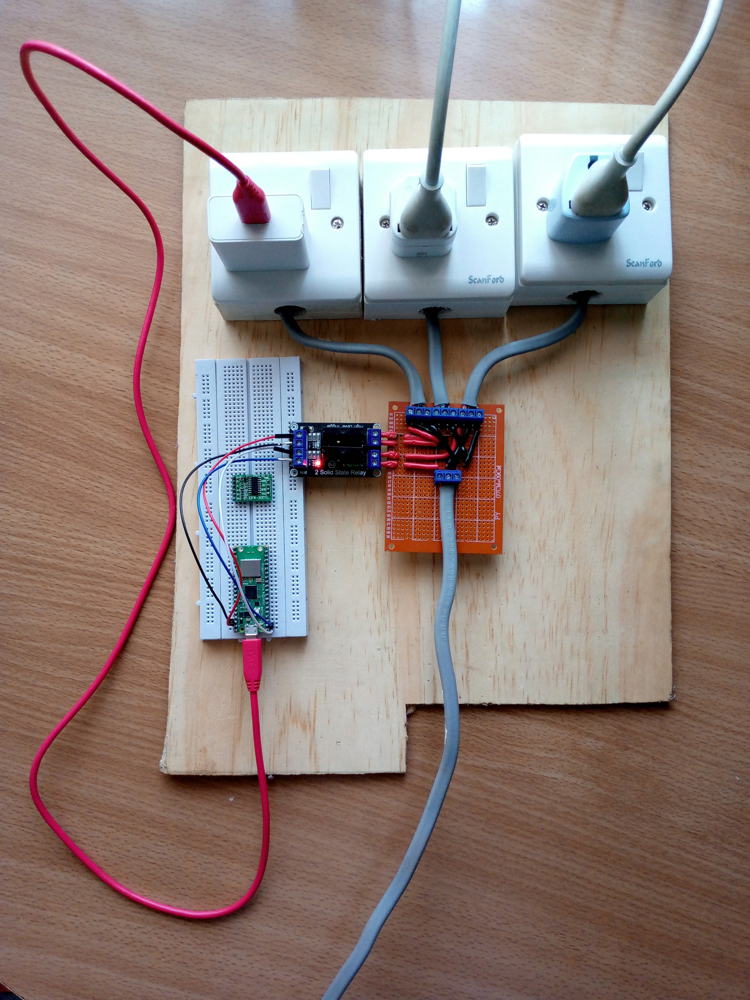
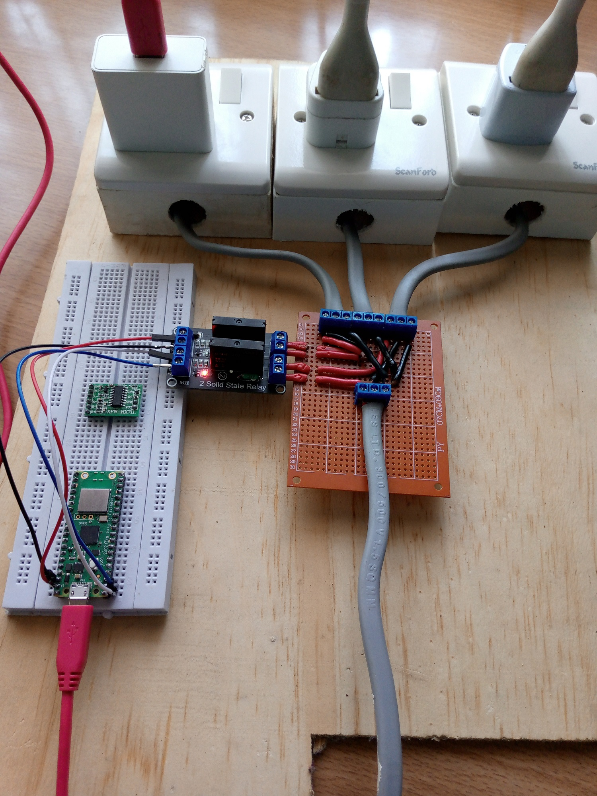

## Charge Control Automation
This application of the Raspberry Pico W servers to automatically control the charging of your device. This is ideal for the following use case:-
- When using a remote device
- Any general remote monitoring of ac power status

I desired this build to be simple and not require any software installations, that is, of course, other than the python modules

#### Requirements
This implementation requires you to have 
- A **simple server** on your target device, I used Flask in this case, just to send requested battery percentage information to the Pico W
- A **dc controlled ac relay**. I used a solid state relay in my case, high level trigger since the power will stay more off than on as per discharging and charging times of the devices. Once can use an electromagnetic relay among others
- On the Raspberry Pico W, a **simple async server**. This is being run just to send requested devices' info to a client through http. In simple terms to have a webpage with the battery information of the devices and the last time checking of the devices
- A simple **protoboard**. This is for the circuit connections

It goes without saying the communication protocol implemented here is http, but this can be changed to as per your liking

#### Full build

#### Challenges faced
This is not really a challenge but I would desire to send date through to the Pico W to turn on or off the sockets whilst using the async server but I'm having challenges sending data to the Pico W whilst using the async server.

