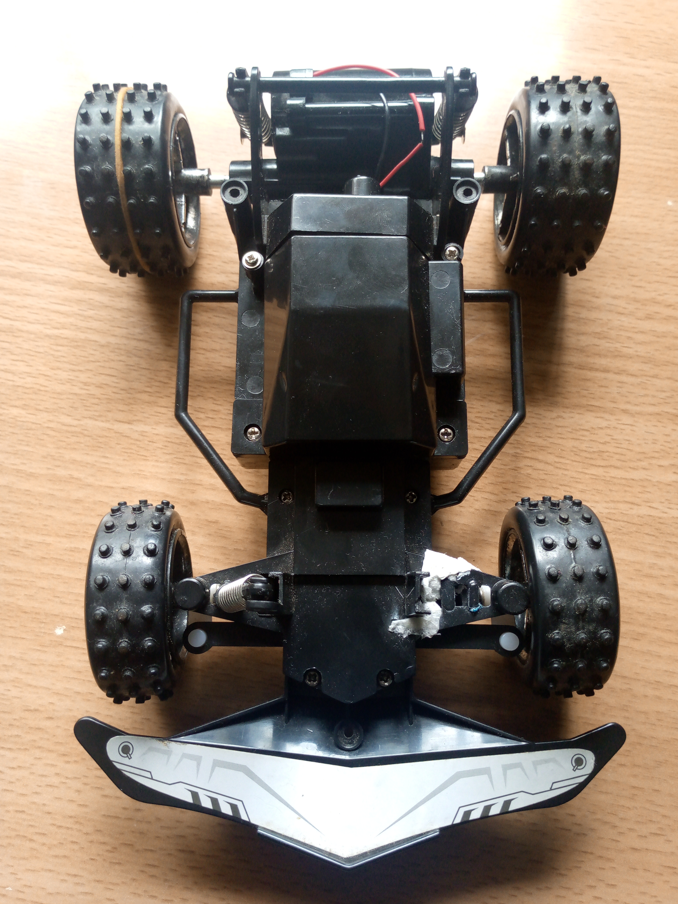
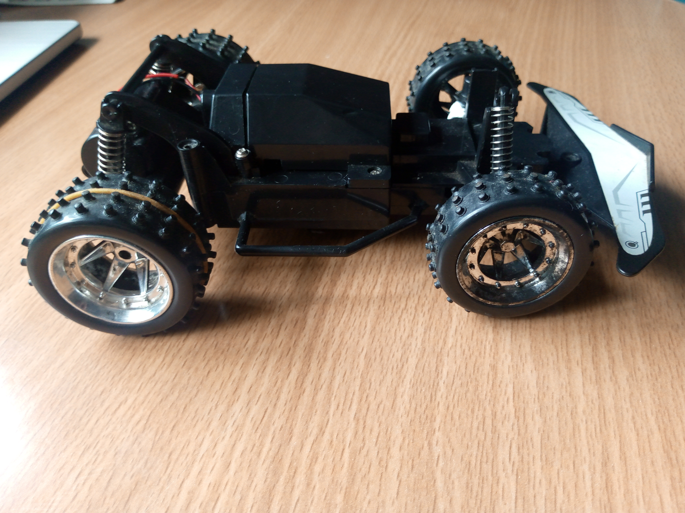

# RC CAR
### A simple project about a rc car based on the Pico W
#### Build so far

 *Will add cut-out for antenna later. As well as schematic*  
This rc car can be controlled through a number of options. (Will be explored if time allows)  
Perhaps the readily available option is Web Control

### Web Control
This method of controlling the rc car aims to use a flask server where the Pico W will send get requests to obtain control information  
The control information will be supplied through a webpage interface provided by the flask server

> #### To Note on the connections  
> A l293d motor driver is below the Pico W and its pins are being referred to here  
> Pin 0 - PWM for 1,2EN driver channels  
> Pin 1 - Output to 1A  
> Pin 2 - Output to 2A  
> Pin 3 - PWM for 3,4EN driver channels  
> Pin 4 - Output to 3A  
> Pin 5 - Output to 4A  

